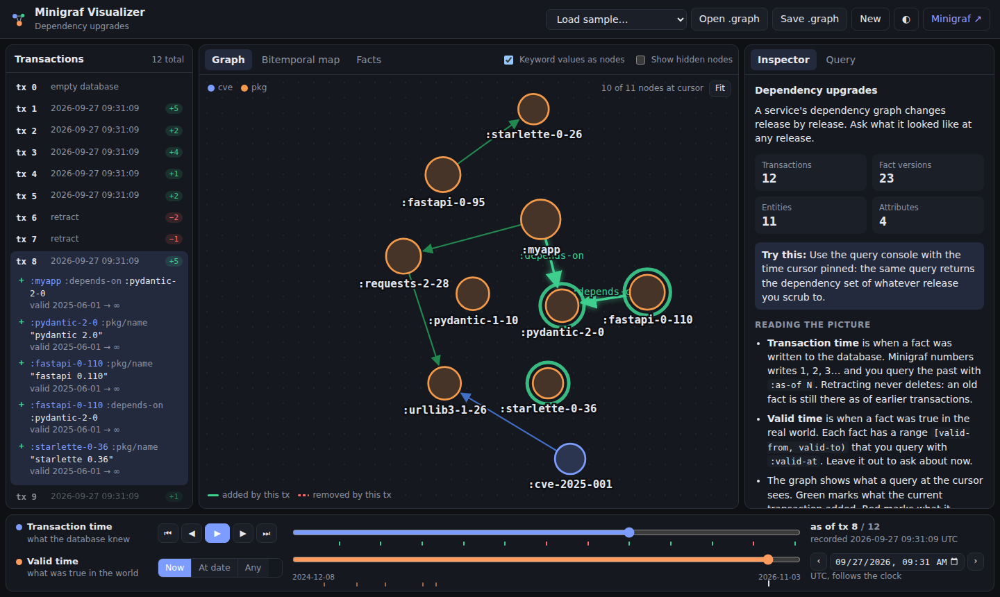
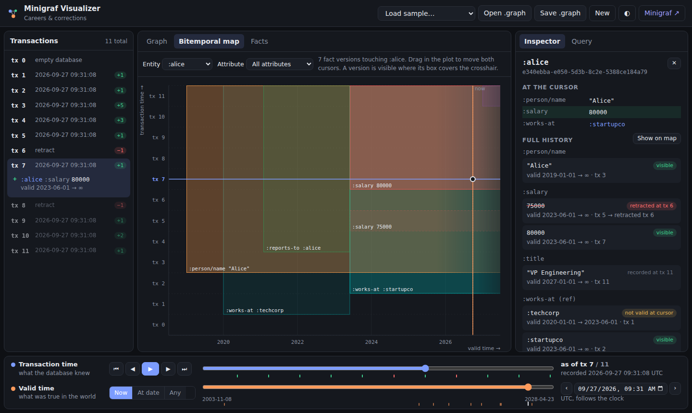

# minigraf-visualizer

**[Open the visualizer →](https://project-minigraf.github.io/minigraf-visualizer/)**

Time travel visualizer for [Minigraf](https://github.com/project-minigraf/minigraf) bi-temporal databases. Part of the Minigraf ecosystem.

Minigraf keeps two kinds of time for every fact:

- **Transaction time**: when the fact was written. You query the past with `:as-of N`.
- **Valid time**: when the fact was true in the real world. You query it with `:valid-at`.

This app lets you move along both axes and see the graph change. Everything runs in your browser on the real Minigraf engine (the `@minigraf/browser` WebAssembly build). No server is involved.



## What you can do

- **Scrub transaction time.** Step, drag or press play. The graph shows what a query at that transaction sees. Green marks what the transaction added. Red marks what it removed.
- **Scrub valid time.** Pick *Now*, a date, or *Any*. The slider snaps to the dates where facts start and stop.
- **Read the bitemporal map.** Each fact version is a box: valid time across, transaction time up. A box that stops below the top was retracted. Drag in the map to move both cursors at once.
- **Inspect an entity.** See what is true at the cursor and every version it ever had, with the transaction that wrote or retracted it. Click a version to jump there.
- **Run Datalog.** The console can pin each query to the time cursor. It adds `:as-of` and `:valid-at` for you. Writes become new transactions and the history is rebuilt.
- **Open and save `.graph` files.** Files are byte-compatible with native Minigraf. Open a file made by the Rust, Python or other bindings (checkpoint it first so no `.wal` sidecar is pending).
- **Share a view.** For the built-in samples, the address bar holds the sample, cursor and selection, for example `#sample=careers&tx=6&vt=2023-06-01T00:00:00Z&e=:alice`.

Your workspace is kept in the browser (IndexedDB) and comes back when you reload.



## Typical workflow

1. **Load data.** Start with a sample, open a `.graph` file, or press *New* and write facts in the *Query* tab.
2. **Find the change you care about.** Read the transaction log on the left. Each row shows how many fact versions it added (`+`) and removed (`−`). Click a row, or press play, and watch the graph. Green is new at that transaction. Red is gone.
3. **Look at one entity or attribute over time.** Click a node. The inspector lists every version with its valid range and the transactions that wrote and removed it. Open the *Bitemporal map* and filter by entity or attribute to see the valid-time intervals as boxes.
4. **Pick a point in both times.** Drag in the map, or use the two sliders. The transaction slider sets what the database knew. The valid-time slider sets the date you ask about.
5. **Ask a question at that point.** In the *Query* tab, keep *Run at the time cursor* on. Your query runs with the cursor's `:as-of` and `:valid-at` added, and the console shows the exact query it ran. Clauses you write yourself are kept.
6. **Keep or share it.** Save the database as a `.graph` file, or copy the address bar link (built-in samples only).

### Samples

| Sample | Shows |
|---|---|
| Careers & corrections | Back-dated jobs, a wrong salary that is corrected, a job that ends, a future-dated promotion |
| Agent memory | An AI agent's beliefs, a retracted belief, and the audit trail behind a recommendation |
| Order state machine | Transitions stored as facts; an order moving through its states |
| Dependency upgrades | A dependency graph across releases, with a recursive rule for transitive dependencies |
| Corestore catalog | The Minigraf tutorial store: a category tree and prices that change over time |

The samples follow the recipes in the [Minigraf wiki cookbook](https://github.com/project-minigraf/minigraf/wiki/Cookbook-Bitemporal-Modeling) and the scenarios in [minigraf-examples](https://github.com/project-minigraf/minigraf-examples).

### Keyboard

| Key | Action |
|---|---|
| `←` / `→` | Previous / next transaction |
| `Space` | Play / pause |
| `Esc` | Clear the selection |
| `Ctrl`+`Enter` | Run the query in the console |

## How it works

Minigraf does not expose its fact log directly. The visualizer rebuilds it with ordinary Datalog:

1. It finds the last transaction number. It copies the database into a scratch in-memory instance (`exportGraph` / `importGraph`), writes one probe fact there, and reads the probe's `:db/tx-count`.
2. For each transaction `N`, it runs one query with `:as-of N` and `:any-valid-time`. The query binds each fact's metadata through the pseudo-attributes `:db/tx-count`, `:db/tx-id`, `:db/valid-from` and `:db/valid-to`.
3. It compares each snapshot with the one before. A fact version that appears at `N` was asserted by `N`. One that disappears at `N` was removed by `N`. Usually that is a `retract`. It can also be a `transact` that writes the same fact with the same valid-time window again: Minigraf then keeps only the newest copy.

Once hidden, a version never comes back, so this diff is exact. When you write through the console, only the new transactions are read.

After that, moving the cursors is pure JavaScript, so it is instant. The filters use the same rules as the engine: a fact is visible when `tx-asserted ≤ N < tx-retracted` and `valid-from ≤ t < valid-to`. The test suite checks this against the real engine at every transaction and every valid-time boundary of every sample.

Minigraf stores `:alice` as a UUID (v5 of the keyword in the OID namespace). The app computes the same UUID, so a value like `:bob` becomes an edge to the entity `:bob`. It also remembers the keywords used in the scripts it runs, so nodes keep readable names. In an opened `.graph` file, entities that no keyword refers to are labelled by a `name`, `title` or `label` attribute, or by a short id.

### Limits

- Opening a database takes one query per transaction, and each query reads every fact. As a guide, 500 transactions with 1,500 facts take about 4 seconds. A progress bar shows while it runs. The app reads at most 5,000 transactions and shows a notice if a file has more.
- Rules are not stored in `.graph` files. The app replays rules for its own workspace, but not for opened files.
- Minigraf 2.x can merge two values of the same attribute on one entity if they are written in one `transact` or `retract` ([minigraf#371](https://github.com/project-minigraf/minigraf/issues/371)). Write each value in its own call. The samples do this.
- The wall-clock time of a retraction-only transaction is not queryable, so the log shows "retract" instead of a time.
- All times are shown and entered in UTC. Minigraf's `:valid-at` takes whole seconds, so a pinned query rounds the valid-time cursor down to the second.
- An opened `.graph` file does not record the keywords used to write it. Entities are named from keyword values that point at them, or from a `name`, `title` or `label` attribute. Other entities show a short id.
- Query results come from the real engine. The graph, map and tables use the rebuilt history, which is checked against the engine in the tests.
- The app runs in the browser only and needs WebAssembly. Your workspace stays in that browser.

## Development

Needs Node.js 22 or newer.

```sh
npm install
npm run dev          # start the dev server
npm test             # unit tests, using the real WASM engine in Node
npm run typecheck    # TypeScript, strict
npm run build        # production build in dist/
npm run test:e2e     # Playwright tests against a production build
```

To run the end-to-end tests with a Chromium you already have, set `CHROMIUM_PATH=/path/to/chrome`.

The build uses relative paths, so `dist/` works from any sub-path. The `Deploy to GitHub Pages` workflow publishes it on each push to `main` (enable Pages with "GitHub Actions" as the source in the repository settings).

### Stack

- [`@minigraf/browser`](https://www.npmjs.com/package/@minigraf/browser) 2.0.2: the Minigraf engine compiled to WebAssembly
- React 19, TypeScript 7, Vite 8
- d3-force, d3-zoom and d3-scale for layout, pan/zoom and time axes
- Vitest and Playwright for tests

### Layout

```
src/lib/        engine wrapper, history rebuild, time filters, graph model (no React)
src/app/        React hooks: workspace, time cursor, view model
src/components/ graph, bitemporal map, facts table, inspector, console, time controls
src/samples/    built-in datasets
tests/          unit tests (run the WASM engine in Node)
e2e/            Playwright tests
```

## License

Licensed under either of:

- Apache License, Version 2.0 ([LICENSE-APACHE](LICENSE-APACHE) or http://www.apache.org/licenses/LICENSE-2.0)
- MIT license ([LICENSE-MIT](LICENSE-MIT) or http://opensource.org/licenses/MIT)

at your option.

### Contribution

Unless you explicitly state otherwise, any contribution intentionally submitted for inclusion in the work by you, as defined in the Apache-2.0 license, shall be dual licensed as above, without any additional terms or conditions.
